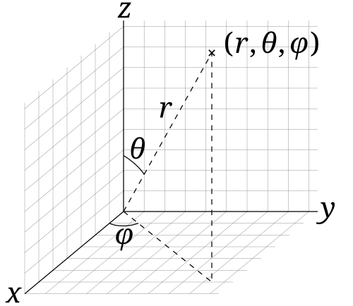

# フライト情報から地球の半径を計算する方法

## 背景
実際のフライト情報を用いて地球の半径を概算する方法を考える。

## 目的

使える情報は

- フライトの時間(秒単位)
- 経度
- 緯度
- 高度(相対高度？)
- 速度
- 飛行機の向いている方向

である。
この情報が、時系列順に並んでいる。
これらの情報を用いて地球の半径6371000.0mを得る方法を考えることを目的とする。

## 方法
### 1. フライト情報を球座標系に一般化
まず、飛行機が地球上を移動する現状を 
一般化してアルゴリズムを作りやすいようにする。

地球は球形なので 
フライトを球座標系の運動としてとらえることにする。 
球座標系では、ベクトルを
$(r, \theta, \phi)$
で表現する。

*図1. 球座標系の模型図*

フライトは緯度経度と高度を変えながら 
地球表面のある地点から別の地点に移動する運動である。

そこで、地球の中心を球座標系の中心として 
経度と緯度をそれぞれ、$\theta$ と $\phi$ に変換して考えると 
フライトの運動を球座標系上の運動として記述しやすくなる。

経度と緯度をそれぞれ、 $\theta$と $\phi$に変換するのは簡単で 
北極点で緯度${\phi}_l$が$1/2 \pi$であることを考えると 
北極点で$\theta$は0であるはずなので

$$
\theta = 1/2 \pi - {\phi}_l
$$

となる。

本初子午線で経度$\lambda$が0であるので

$$
\phi = \lambda
$$

となる。

また、地球の中心から飛行機までの距離$r$は 
地球の半径$R$と飛行機の高度$h$の和であるはずなので。

$$
r = h + R
$$

さて、この一般化によって問題は以下のようになる。

飛行機の運動について 

飛行機の位置$\boldsymbol{r} = (h+R, \theta, \phi)$ 
飛行機の速度の大きさ$v$ 
飛行機の向き$\theta_{dir}$ 

についてまとめたデータが
時間$t$とともにn個並んでいる。

これらのデータのレコードを$\boldsymbol{F}_{t}$とする。
$$
\boldsymbol{F}_{i} = (t, h, \theta, \phi, v, \theta_{dir})
$$

フライト情報から地球の半径を計算する問題とは 
$\boldsymbol{F}_{t}$から地球の半径$R$を計算するという問題である。

### 2. 球座標系で2点の距離と角度から、中心からの距離を計算する

さて、ここからは球座標系においての 
ベクトルの扱いから中心からの距離を計算する方法を考える。 

地球の半径をRを、
球座標系の2点の角度$\theta$, $\phi$と高度$h$ 
2点間の距離$d$ 
から半径Rを解析的に解くことにする。 

まず、2点のベクトルをそれぞれ
$\boldsymbol{F}_{1}=(r_1 = h_1 + R, \theta_1, \phi_1)$、$\boldsymbol{F}_{2}=(r_2 = h_2 + R, \theta_2, \phi_2)$
とする。

この時、2点間の距離$d$は 

$$

\begin{aligned}
d^2 &= |\boldsymbol{F}_{1}-\boldsymbol{F}_{2}| \\
&= r_1^2 + r_2^2 -2r_1r_2*cos\gamma \\
cos\gamma &= sin(\theta_1)sin(\theta_2)cos(\phi_1-\phi_2) - cos(\theta_1)cos(\theta_2)
\end{aligned}
$$
これを$r_1 = h_1 + R$と$r_1 = h_1 + R$を代入して 
まとめると

$$
\begin{aligned}
d^2 &= (h_1 + R)^2 + (h_2 + R)^2 - 2(h_1 + R)(h_2 + R)cos\gamma\\
&= 2(1-cos\gamma) R^2 + 2(h_1+h_2)(1-cos\gamma)R + (h_1^2+h_2^2-2h_1h_2cos\gamma)
\end{aligned}
$$

この式をRについて解くと簡単な二次方程式の解

$$
\begin{aligned}
R &= \frac{-B \pm \sqrt{B^2 - 4AC}}{2A} \\
A &= 2(1-cos\gamma) \\
B &= 2(h_1+h_2)(1-cos\gamma) \\
C &= h_1^2+h_2^2-2h_1h_2cos\gamma - d^2
\end{aligned}
$$

を得ることができる。 
これを解くことで、正の解が地球の半径になるはずである。

さて、この結果から 
私たちが持っている情報である 
$\boldsymbol{F}_{i} = (t, h, \theta, \phi, v, \theta_{dir})$ 
から$A,B,C$を計算すればよいことが分かった。

### 3. フライト情報から方程式の係数を計算
ある時間の$\boldsymbol{F}_{i}$と別の時間の$\boldsymbol{F}_{j}$を比べることによって係数を計算したいが 
角度である$\theta,\phi,h$はそのまま情報から取得することができる。 
問題は、$\boldsymbol{F}_{i}$と$\boldsymbol{F}_{j}$の距離$d^2$を得ることである。 
ここでは、$d^2$を$\boldsymbol{F}$の速度$v$と飛行機の向き$\theta_{dir}$から求める方法を考える。 

概算だけなら簡単で 
飛行機の向き$\theta_{dir}$が 
時系列的に変化していない時間帯(直線フラグメント)を距離の計算候補にして 
それぞれの時間と速度から移動距離を足し合わせるだけである。

#### 3.1 フラグメントの計算
フラグメントの判定は以下のようなものを採用した。 
フラグメント$Fr$は$(i_{start}, i_{end})$というように$\boldsymbol{F}$の連続したインデックスを示す。 
具体的な計算方法は 
たとえば、$\boldsymbol{F}_{k}$から計算を始めたとして 
$\theta_{diff} = |\theta_{dir}(k+\Delta k + 1)-\theta_{dir}(k+\Delta k)|$ 
が閾値よりも小さくなるまで 
$\Delta k$が0から1つずつ大きくしていく。 
このとき、$\theta_{diff}$が閾値を超えたときの$\Delta k$を用いて
$Fr_k=(k, k+\Delta k)$とする。 
このような計算を$k=0$から行い、 
$Fr_k$が得られたときに 
再度、$k+\Delta k$から同じ操作を始める。 
こうすることで、いくつかの$Fr$を得ることができる。 
得られた$Fr_i = (i, i+\Delta k_i)$の中で、$\Delta k_i$が大きい$Fr_i$を 
移動距離$d^2$を計算するフラグメントの候補とする。
$\Delta k_i$の大きさはすなわち、どれだけのレコードの数分だけ角度が変わっていないのかという情報になる。 
すなわち、できるだけ長い距離を直線移動したフラグメントを取得するアルゴリズムということになる。

-- 補足 -- 
この方法では、$\theta_{diff}$が閾値よりも小さく、しかし長く同じ方法に$\theta_{diff}$があるようなフラグメント 
たとえば、適度な角度で円運動するような飛行機の軌道で、正しくフラグメントを得られない可能性がある。 
しかし、そのようなことは少ないという仮説の元計算を行っている。 
あくまで、概算ということに留意していただきたい。 
#### 3.2 フラグメントから距離$d^2$を計算する
計算するフラグメントの候補が得られたら後は簡単に距離を計算することができる。 
$Rf=(i_{start}, i_{end})$を得られたとして以下のように$d$を計算した。 

$$
d = \sum_{i = i_{start}}^{i_{end}-1} v_i * (t_{i-1} - t_{i}) 
$$

さて、これらの情報を用いて地球の半径を計算することができる。

## 結果

これまでに得られた式は以下である。 

$$
\begin{aligned}
R &= \frac{-B \pm \sqrt{B^2 - 4AC}}{2A} \\
A &= 2(1-cos\gamma) \\
B &= 2(h_1+h_2)(1-cos\gamma) \\
C &= h_1^2+h_2^2-2h_1h_2cos\gamma - d^2
\end{aligned}
$$

$$
d_i = \sum_{i = i_{start}}^{i_{end}-1} v_i * (t_{i-1} - t_{i}) 
$$

この式は参考にするフラグメント$Fr_i$によって複数の$R_i$が計算できることを意味している。 
実際に、これらの式から地球の半径を計算したときに、地球の半径に近しい6,378 kmを得られたことを確認した。

## 補足
このアルゴリズムではフラグメントの取り方を選ぶことが重要である。 
そのため、閾値などを調整したり、アルゴリズムを変えたりして計算できる地球の半径がどの程度精度よく出るのか試してほしい。
